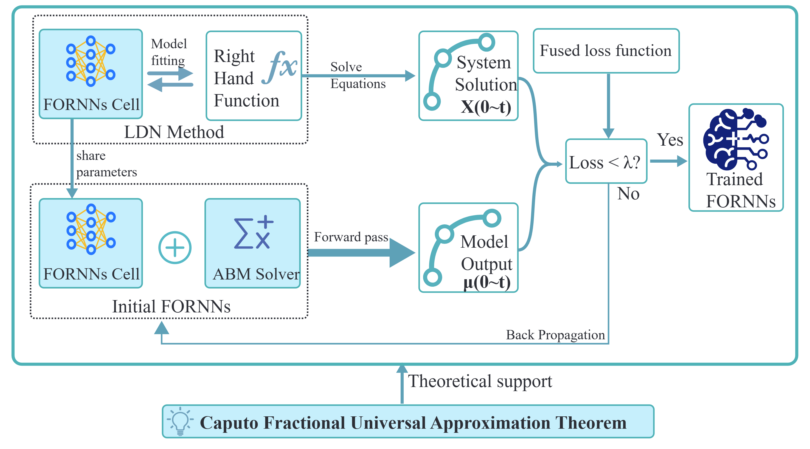

# 

This repository contains the code to replicate the results presented in the paper "Fractional-Order RNNs: A Universal Approximation Framework for Non-Local Dynamic System Modeling".

 
Workflow of FORNNs. 
    As for the theoretical contribution,
    this study proves, for the first time, the capability of
    fractional order RNNs to approximate Caputo fractional order ordinary differential
    equation system.
    As for the practical applications,
    the LDN method is introduced to tackle the
    convergence challenges of FORNNs.

## Abstract

Recurrent neural networks (RNNs) endowed with continuous-time
states have emerged as an adaptive framework for modeling dynamic
systems. Among these systems, Caputo fractional order
ordinary differential equation systems (CFODEs) are gaining prominence
due to their non-local characteristics over time.

This study theoretically demonstrates, for the first time,
the capability of fractional-order RNNs (FORNNs) to universally approximate
CFODEs with arbitrary precision.

Concurrently, during the application of FORNNs to practical scenarios,
the negative impact of the complexity of parameter space and
ABM solver on FORNNs' performance is first revealed,
which are referred to as "Parameter Domain Problems"(PDPs).
In response to PDPs,
We propose
the Local Domain Normalization (LDN),
along with introducing a novel loss function to rectify the
Hallucination Problem encountered during the learning process.
Finally, two real-world examples are presented and validate
the superior performance of FORNNs,
which are entirely consistent with the theoretical proofs,
and also confirm the effectiveness of LDN method.

## Our contribution:

- We propose an effective, novel, and interpretable state-space model, FORNNs,
  which exploits the non-locality of fractional-order gradients.
  Additionally,
  we present a new learning framework, LDN,
  specifically designed for FORNNs.
- This work theoretically demonstrates the capability of
  FORNNs to approximate CFODEs
  with arbitrary accuracy $\epsilon_1$,
  for the first time.
- In three tasks, FORNNs exhibit superior performance in terms of $\epsilon$,
  fitting accuracy
  and convergence difficulty,
  compared to other integer-order state-based benchmarks.
- During the application of FORNNs to practical scenarios,
  the negative impact of the complexity of parameter space and
  ABM solver on FORNNs' performance is first revealed,
  which are referred to as 'Parameter Domain Problems'(PDPs) and Hallucination Problem.

## Files

- `FORNNs_run.py`: Running this file can fully demonstrate the learning process and results of FORNNs.
- `FORNNs_hyperparameters.py`: Contains preset parameter information used in `FORNNs_run.py`.
- `base_model_run.py`: Contains the implementation of various baseline models used for comparison in the experiments.
- `base_model_hyperparameters.yaml`: Contains hyperparameter settings for the baseline models in `base_model_run.py`.
- `model.py`: Includes model architectures and loss functions used in the work.
- `utils.py`: Contains utility functions used in the main file.
- `./Figure`: Records the pictures drawn during program operation
- `./Manuscript`: Some images from the paper are saved to help readers on GitHub better understand our project
- `./lib` : Contains implementations for `RNNDecay` and `ODERNN`(based source code: https://github.com/YuliaRubanova/latent_ode/tree/c0682d4f52b806fb88d965755892eadd9783f936/lib; Source Paper: https://arxiv.org/abs/1907.03907)
## Quick Start
To replicate the results:

1. Clone this repository to your local machine:  
   `git clone https://github.com/AmFe-GH/FORNNs`
2. Enter your conda environment:  
   `conda activate <your_env_name>`
3. Install the required packages:  
   `pip install -r requirements.txt`
4. Run `python FORNNs_run.py`.

## Citation

If you use this code in your research or find it helpful, please consider citing the original paper:
https://ieeexplore.ieee.org/document/11072224

