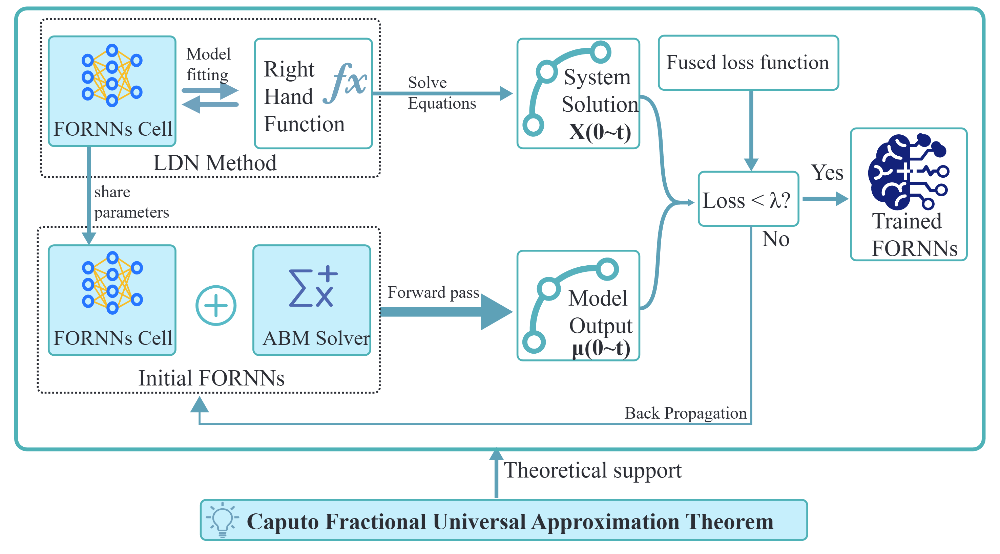

 
 

 
#  
This repository contains the code to replicate the results presented in the paper "Caputo fractional order recurrent neural networks: efficiently modeling dynamic systems with state spaces". 

 
Workflow of FORNNs. 
    As for the theoretical contribution,
    this study proves, for the first time, the capability of
    fractional order RNNs to approximate Caputo fractional order ordinary differential
    equation system.
    As for the practical applications,
    the LDN method is introduced to tackle the
    convergence challenges of FORNNs.

## Abstract
  Recurrent neural networks (RNNs) endowed with continuous-time 
  states have emerged as an adaptive framework for modeling dynamic
  systems. Among these systems, Caputo fractional order 
  ordinary differential equation  systems (CFODEs) are gaining prominence
  due to their non-local characteristics over time. 

  This study theoretically demonstrates, for the first time,
  the capability of fractional-order RNNs (FORNNs) to universally approximate
  CFODEs  with arbitrary precision.

  Concurrently, during the application of FORNNs to practical scenarios,
  the negative impact of the complexity of parameter space and
  ABM solver on FORNNs' performance is first revealed,
  which are referred to as "Parameter Domain Problems"(PDPs).
  In response to PDPs,
  We propose
  the Local Domain Normalization (LDN),
  along with introducing a novel loss function to rectify the
  Hallucination Problem encountered during the learning process.
  Finally, two real-world examples are presented and validate
  the superior performance of FORNNs,
  which are entirely consistent with the theoretical proofs,
  and also confirm the effectiveness of  LDN method.

## Perfoermance Comparison

 

Here, a comparative analysis is
conducted to evaluate the performance of
the proposed FORNNs against other existing integer-order
state-based models, as shown above. 
These models include MLP, S4 
and  various forms of recurrent neural networks (RNNs,
LSTM, WMC-LSTM, GRU, and SRU).

In terms of the model structures,
The MLP mentioned here consists of a single hidden
layer with five neurons. Other temporal models
referenced in this context retain their original
structures as described in the corresponding papers,
with only a reduction in the number of parameters.

In terms of the ability to fit dynamic systems,
FORNNs have demonstrated superior performance compared
to other proposed models, achieving convergence with
fewer training iterations. Additionally, the performance
observed from $FORNNs-L$ ($N$ = 10) to $FORNNs-XL$ ($N$ = 100)
indicates that a larger number of parameters significantly
enhances the model's learning capacity, leading to a marked
decrease in $\epsilon$. However, this also
increases the number of training epochs  required for
convergence. This phenomenon suggests that $N$ should be flexibly
chosen to balance learning capacity and convergence speed.

## Files
- `main.py`: This is the main file. Running this file can fully demonstrate the generation and processing of training data, as well as the learning process and results of FORNNs.
- `Hyperparameters.py`: Contains preset parameter information used in the experiments.
- `LDN.py`: Implements the Local Domain Normalization method described in the paper. Note that this module has been integrated into main.py. Normally, you do not need to run this file manually.
- `model.py`: Includes model architectures and loss functions used in the experiments.
- `utils.py`: Contains utility functions used in the main file.
- `Plot3D.py`: A utility class for plotting 3D figures.`
- `./Figure`: Records the pictures drawn during program operation
- `./Manuscript`: Some images from the paper are saved to help readers on GitHub better understand our project
- 

## Instructions

To replicate the results:

1. Clone this repository to your local machine:  
   `git clone https://github.com/AmFe-GH/FORNNs`
2. Enter your conda environment:   
   `conda activate <your_env_name>`
3. Install the required packages:  
   `pip install -r requirements.txt`
4. Run `main.py`.  

## Citation

If you use this code in your research or find it helpful, please consider citing the original paper:

<!-- ##    Acknowledgements

This work was supported by National Natural Science Foundation of China
(Grant 12101430) and Department of Science and Technology of Sichuan
Province (Grant 2021ZYD0018). (Corresponding author: Cong Wu.)(https://yjs.cd120.com/contents/559/1710.html) -->
